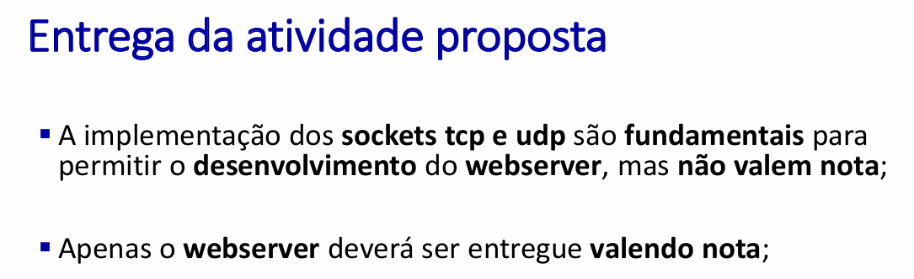
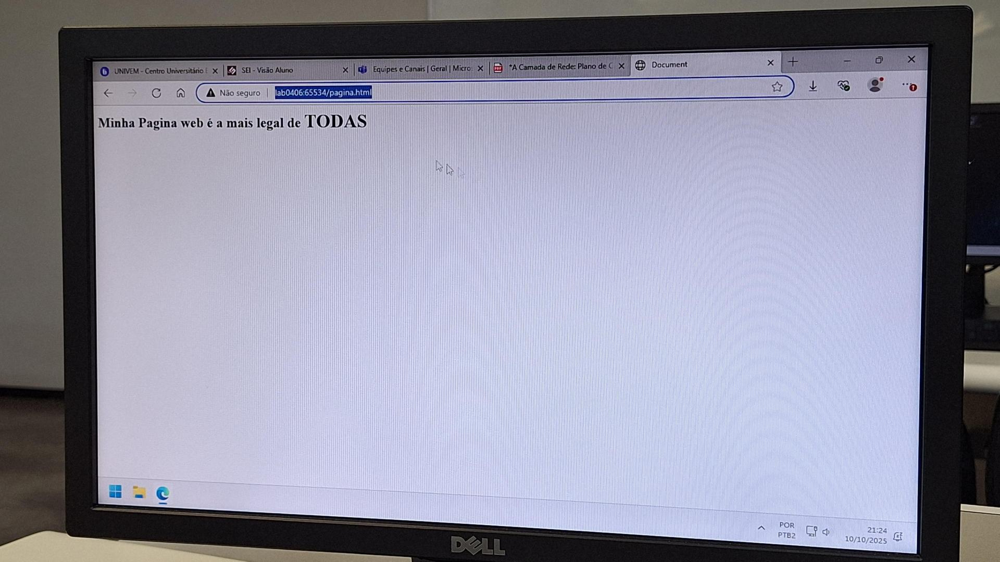
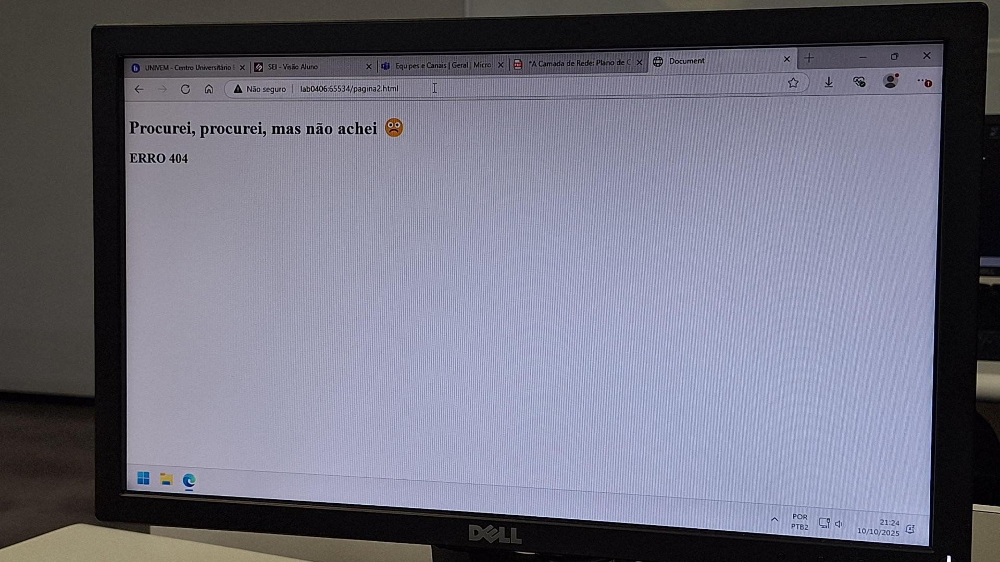

# Implementando um servidor web simples em python
### Esse repositorio foi feito para a seguinte atividade:

Observações: O projeto deve conter pelo menos duas paginas, uma pagina normal, e outra que será utilizada para o erro 404

#### Rodando o projeto
Para rodar o projeto basta rodar o arquivo webserver.py digitando python .../webserver.py

### Testando
Para enviar requisições ao servidor basta abrir qualquer navegador e digitar "http://localhost:65534/pagina.html" na barra de navegação, caso o servidor esteja rodando em outro computador na mesma rede local, é necessario trocar "localhost" pelo nome da maquina que está rodando a aplicação.

### Testando a pagina de erro
Basta trocar alguma parte do caminho da aplicação para uma não existente, por exemplo "http://localhost:65534/Testando123.html". Lembrando que no codigo, ao enviar a pagina de erro o socket é fechado e a aplicação. Porem basta remover o "break" na linha 42 para continuar rodando a aplicação mesmo com erro.

### Demonstrando a aplicação funcionando em rede local (LAN)
Pagina de erro: 

Pagina correta:

